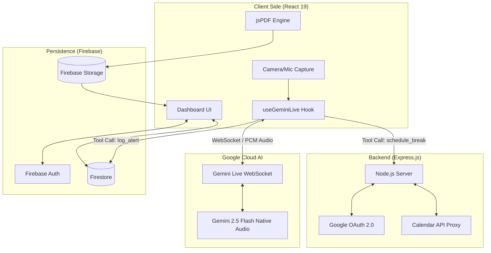

# Misi App Architecture Diagram

Misi is built on a high-performance, real-time architecture that synchronizes multimodal AI intelligence with workspace productivity tools.

## System Overview

## Data Flow Description

1.  **Multimodal Input**: The frontend captures raw video frames and PCM audio, streaming them directly to the **Gemini Live API** via a bidirectional WebSocket.
2.  **AI Reasoning**: **Gemini 2.5 Flash** processes the stream in real-time, identifying postural red flags and emotional states.
3.  **Agentic Tool Calls**: When an issue is detected, Gemini triggers "Tool Calls" (Function Calling):
    *   `log_alert`: Persists the event directly to **Firestore**.
    *   `schedule_recovery_break`: Communicates with the **Express Backend** to interact with the **Google Calendar API**.
4.  **Biofeedback**: Gemini generates real-time voice responses, which are streamed back to the client and played via the **Web Audio API**.
5.  **Reporting**: At the end of a session, the **jsPDF engine** synthesizes Firestore logs into a professional report, which is then archived in **Firebase Storage**.
